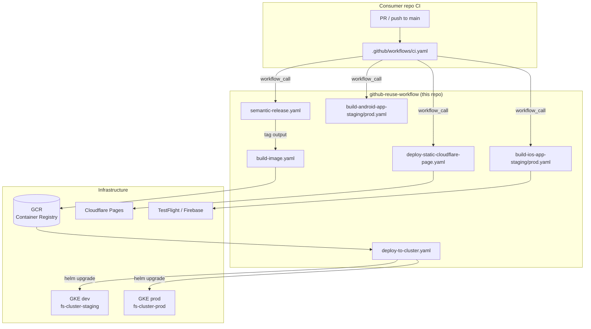
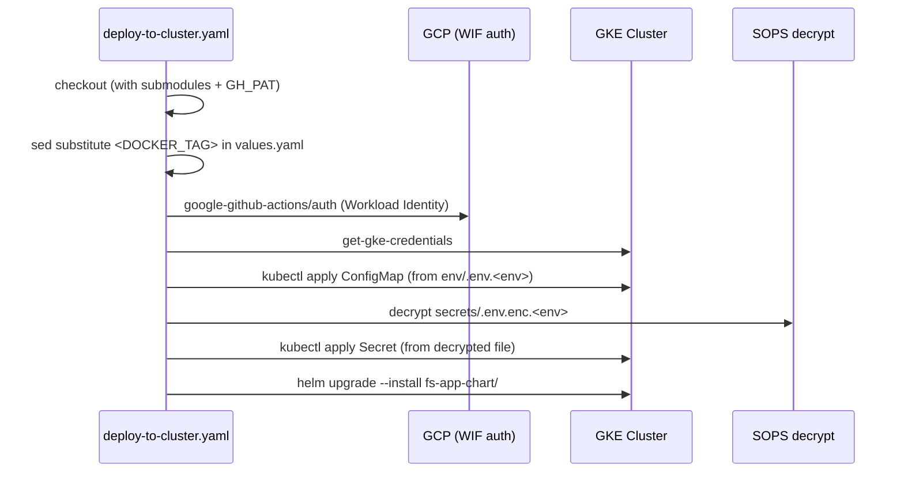

## Architecture — github-reuse-workflow

**Canonical overview:** [fs-infrastructure architecture](https://github.com/LikeMeX/fs-infrastructure/blob/main/docs/architecture.md)

### Workflow inventory

All files live under `.github/workflows/` and are triggered exclusively via `workflow_call`.

#### Release & versioning

| Workflow | Key action | Outputs |
| --- | --- | --- |
| `semantic-release.yaml` | `cycjimmy/semantic-release-action@v4` (semantic_version 19) | `tag`, `new_release_published`, `latest_tag` |
| `semantic-release-mobile.yaml` | Same + `BUILD_NUMBER` input for `v${version}+${BUILD_NUMBER}` tag format | `tag`, `new_release_published`, `latest_tag` |
| `get-tag.yaml` | Reads latest git tag | `tag` |
| `lastest-buildnumber-release.yaml` | Queries App Store / Play Store for latest build number | `build_number` |

#### Build

| Workflow | Runner | What it builds |
| --- | --- | --- |
| `build-image.yaml` | `ubuntu-latest` | Docker image → GCR |
| `build-ios-app-staging.yaml` | `macos-15` | Flutter iOS (Xcode 16, Flutter 3.38.4) → Firebase Distribution + TestFlight |
| `build-ios-app-prod.yaml` | `macos-15` | Flutter iOS → TestFlight (production) |
| `build-android-app-staging.yaml` | `ubuntu-latest` | Flutter Android APK/AAB (staging) |
| `build-android-app-prod.yaml` | `ubuntu-latest` | Flutter Android APK/AAB (production) |
| `static-site-export.yaml` | `ubuntu-latest` | Next.js static export → uploads `out` artifact |
| `npm-publish.yaml` | `ubuntu-latest` | pnpm build → `npm publish` via OIDC |

#### Deploy

| Workflow | Target | Mechanism |
| --- | --- | --- |
| `deploy-to-cluster.yaml` | GKE (dev / production) | `helm upgrade --install` with SOPS-decrypted secrets |
| `deploy-static-cloudflare-page.yaml` | Cloudflare Pages | `cloudflare/wrangler-action@2.0.0` |

#### Utility

| Workflow | Purpose |
| --- | --- |
| `get-ci-environment.yaml` | Resolves CI environment name from branch or tag |
| `backup-to-gcp.yaml` | Backs up files/databases to a GCS bucket |
| `code-scanning.yaml` | Bearer SAST scan (`bearer/bearer-action@v2`) |
| `discord-notification.yaml` | Posts a Discord webhook on release events |
| `test.yaml` | Generic test runner |

### How consumer repos call these workflows

### deploy-to-cluster.yaml — step sequence

